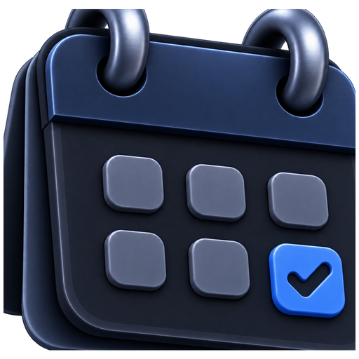

### `Neo Calendar`

Neo Calendar keeps your events in your own files, on your own disk. Windows, Android, and your Obsidian vault.

[Download](https://ahmed-mili.github.io/neo-calendar/) • [Install guide](docs/guide/install.md) • [Release Notes](https://github.com/ahmed-mili/neo-calendar/releases) • [Develop](docs/guide/develop.md)

## What you get

- `App` - Day, week, month and list views on Windows; day, three days and list on the phone. Same calendar, same files. Updates itself.
- `Files` - Every event is a Markdown note in a folder you choose. Readable without the app, and at home in an Obsidian vault.
- `Feeds` - Subscribe to any ICS link. Your timetable stays in sync, and your reminders follow it.

## Download website

The bilingual download site is in [`docs/`](docs/index.html) and deploys from [the Download site workflow](.github/workflows/pages.yml). Once this pull request is merged, select **Settings → Pages → Build and deployment → Source: GitHub Actions** once if Pages is not yet enabled; deployments then run automatically on updates to the site. The Windows installer and Android APK links are selected from the actual assets of the latest stable release. If GitHub's API cannot be reached, both cards link to the latest release page.

## Contributing

If you'd like to report a bug, please do so on our [GitHub Issues page](https://github.com/ahmed-mili/neo-calendar/issues).

Neo Calendar is an open-source project under the [MIT license](LICENSE). Please take a look at the [contribution guidelines](./docs/contribute.md) before getting started!
